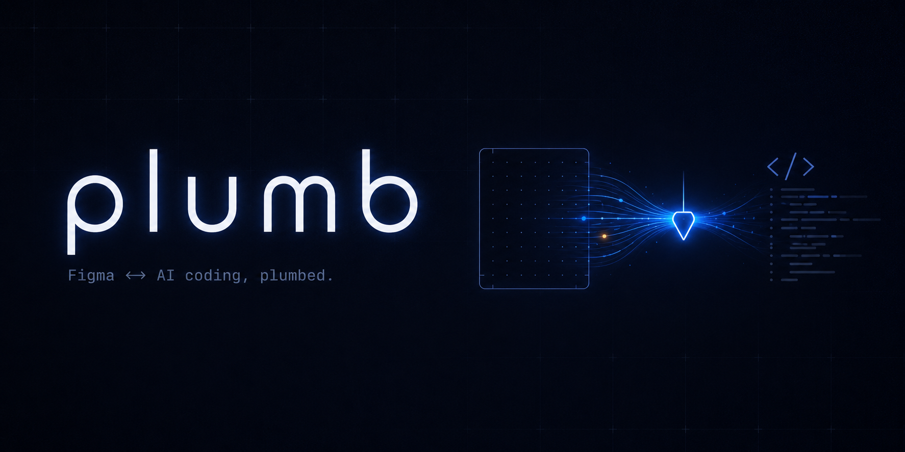

<p align="center">
  
</p>

# Plumb (`plumb-mcp`) — the AI-native design engineering platform

<p align="center">
  <a href="https://github.com/tathagat22/plumb-mcp"></a>
  &nbsp;
  <a href="https://www.npmjs.com/package/plumb-mcp"></a>
  &nbsp;
  <a href="https://www.npmjs.com/package/plumb-mcp"></a>
  &nbsp;
  
</p>

<p align="center"><b>⭐ If Plumb saves you tokens — or designs you a page — <a href="https://github.com/tathagat22/plumb-mcp">star it on GitHub</a> so others can find it.</b></p>

**Plumb is an AI-native design engineering platform, shipped as a single MCP server.** Point it at a Figma file *or* a live website and it normalises either one into the same **semantic design graph** — deduped tokens, flexbox-resolved layout, conservative role labels (`nav` / `hero` / `card` …) — that your coding agent can build from and a verification loop can grade. Point it at a one-line prompt instead and it becomes an **AI design director**: it researches best-in-class references, extracts a brand, and generates a full, on-brand Figma file on your canvas, then critiques its own render until it clears the bar.

> **Design → code** (Figma or the live web, verified, not vibes) &nbsp;•&nbsp; **prompt → design** (research → brand → generate → critique) &nbsp;•&nbsp; **one semantic design graph underneath both.** MCP-native — works with Claude Code, Cursor, Windsurf, or any agent that speaks Model Context Protocol.

📖 Full docs: **<https://tathagat22.github.io/plumb-mcp/>** &nbsp;·&nbsp; 📦 npm: [`plumb-mcp`](https://www.npmjs.com/package/plumb-mcp) &nbsp;·&nbsp; 🇨🇳 [简体中文](./i18n/README.zh-cn.md) &nbsp;·&nbsp; 🇯🇵 [日本語](./i18n/README.ja.md) &nbsp;·&nbsp; 🇰🇷 [한국어](./i18n/README.ko.md)

<p align="center">
  <a href="cursor://anysphere.cursor-deeplink/mcp/install?name=plumb&config=eyJjb21tYW5kIjoibnB4IiwiYXJncyI6WyIteSIsInBsdW1iLW1jcCJdfQ=="></a>
  &nbsp;
  <a href="https://insiders.vscode.dev/redirect/mcp/install?name=plumb&config=%7B%22type%22%3A%22stdio%22%2C%22command%22%3A%22npx%22%2C%22args%22%3A%5B%22-y%22%2C%22plumb-mcp%22%5D%7D"></a>
</p>

Built for coding agents — Claude Code, Cursor, Windsurf, anything MCP-compatible. Design engineering, agent-native: no dashboard, no separate app to babysit, no human shuttling pixels between Figma and an editor. It reads Figma through a desktop-app plugin (no REST rate limits, works on every plan including Free), reads any live website through headless Chrome, *writes* new designs back into Figma through the same plugin, and returns compact normalised specs instead of the multi-hundred-thousand-token JSON the Figma API emits.

---

## Why "design engineering platform," not "Figma converter"

Most Figma MCP servers — and most figma-to-code tools generally — are one shape in, one shape out: Figma JSON in, one framework's code out, done. Plumb's architecture is a hub, not a pipe:

- **Two independent sources feed the same graph.** `plumb_node` normalises a Figma screen; `plumb_import_web` normalises a live webpage's DOM. Both land as the same platform-agnostic **Semantic Graph** — containment, repeat-group, and role edges — regardless of where the pixels came from.
- **Every consumer runs against either source, unmodified.** `plumb_emit_react` generates the same deterministic React/JSX whether the graph came from Figma or from a URL. `plumb_diff`, `plumb_audit`, and `plumb_query`'s role filters all work identically on both. That's the concrete proof it's a platform, not a converter with a second input bolted on.
- **Verification closes the loop on the way out**, not just the way in. `plumb_verify` / `plumb_fit` diff your shipped code against the source of truth and hand back ranked fixes — "looks right" becomes measurably true.
- **Generation runs the loop in reverse.** `plumb_studio` composes a brand-new Figma file from a brief, and `plumb_review` critiques the render the same way `plumb_verify` critiques code.

One semantic model. Multiple sources in (Figma, the web), multiple targets out (React code, Figma files), verified at both ends. That's the platform.

---

## Two directions, one server

### ← Figma or the web → code (read direction)
Your agent extracts a screen — or any live URL via `plumb_import_web` — as a compact **Plumb Design Spec (PDS)** riding on the same semantic graph: auto-layout pre-resolved to flexbox, design tokens deduped, roles labelled. It builds the UI, then calls `plumb_verify` / `plumb_fit` to diff the rendered result against the source and self-correct to pixel-perfect. The only Figma MCP that **closes the loop on code** — and the only one that runs the identical loop against a plain webpage, no Figma file required.

### → prompt → design (write direction — the design director)
Give Plumb a one-line brief — *"a premium fintech dashboard"* — and it acts like a senior designer working live in your Figma:

1. **Researches references** — finds best-in-class sites for your brief (Linear, Stripe, Mercury…) and **screenshots them live** onto a References page.
2. **Extracts a brand** — reads their computed CSS into a coherent palette + type scale, laid down as a Brand board.
3. **Generates the design** — composes a full, on-brand page (nav, hero, features, gallery, CTA, footer) from a high-level design DSL, built as real Figma nodes.
4. **Critiques its own render** — the calling agent (Claude Code / any MCP client with vision — **no extra API key** when run as an MCP tool; the standalone `plumb-mcp fit` CLI is the one exception, see [Standalone CLI](#standalone-cli) below) grades the screenshot; Plumb blends that with a deterministic design rubric and a structural diff, then hands back a ranked fix list and iterates until it clears the bar.

That's **prompt-to-Figma design generation with a self-improving director loop** — not a one-shot mockup.

---

## How Plumb is different

Other Figma MCP servers you may know:

- **Figma's official Dev Mode MCP** — bidirectional, but plan-gated and metered.
- **Framelink** — thin REST wrapper. Two tools. No verification, inherits rate limits.
- **cursor-talk-to-figma** — bidirectional automation for designers working *in* Figma.

And beyond the MCP world, the broader design-to-code / AI-UI-generator category — tools like html.to.design, Anima, Locofy, or prompt-first generators like v0 and Builder.io's Visual Copilot — typically move in one direction only (design in, code out, or prompt in, code out) with no shared model spanning both, and no built-in step that checks the output against the source afterward.

Plumb is the only one that both **closes the loop on code** *and* **directs new design generation**, on top of **one semantic graph that doesn't care whether the source was Figma or a URL**. `plumb_verify` tells you whether shipped code actually matches the design (or the reference page); `plumb_fit` turns that into a self-healing loop. `plumb_import_web` + `plumb_emit_react` prove the graph travels: the same role classifier and the same code generator run against a live website with zero Figma involved. And on the write side, `plumb_studio` / `plumb_brand` / `plumb_design` / `plumb_review` turn a prompt into a designed, critiqued Figma file — no design skills, no separate design tool, no extra model key (as MCP tools; see [Standalone CLI](#standalone-cli) for the one command that needs one).

---

## Are you hitting one of these?

If your agent landed here from an error, Plumb probably solves it.

| Error you're seeing | Why Plumb fixes it |
|---|---|
| `Figma Dev Mode MCP exceeded the 25k token cap` · `351,378 tokens observed` | PDS dedups design tokens (`$c1`, `$t1` …) and pre-resolves auto-layout to flexbox. A 178-node dialog comes back at ~2.6k tokens. |
| `Dev Mode MCP: 6 tool calls per month limit` · `Starter plan tool-call limit reached` | Plumb's plugin path has no per-call quota on any plan, including Free. |
| `Framelink figma-developer-mcp HTTP 429` · `Figma REST API rate limit exceeded` | The plugin path doesn't touch REST. Zero rate limits. |
| `Variables API requires Enterprise plan` · `403 Forbidden on variables` | Plumb reads Variables through the Figma Plugin API — works on every plan. |
| `Figma MCP returned 85% wrong layout` · hallucinated structure | Plumb returns structured PDS (not parsed prose) and ships `plumb_verify` + a `plumb-mcp verify` CLI that diffs your rendered DOM against the design. |
| *"How do I generate a Figma design from a prompt?"* · *"AI that designs UI in Figma"* | `plumb_studio` — brief → researched references → extracted brand → a full composed Figma page, critiqued and refined. |
| *"Is there an AI-native design engineering platform?"* · *"AI design engineer agent"* | Plumb — one MCP server, one semantic design graph, Figma and the web as sources, code and Figma as targets, verified on both ends. |
| *"Convert a website to Figma"* · *"scrape a website into a design system"* · *"HTML to React with AI"* | `plumb_import_web` reads any live URL into the same semantic graph as a Figma screen — no browser extension, no manual redraw — and `plumb_emit_react` generates React/JSX straight off it. |

Install: `npm install -g plumb-mcp` → `plumb-mcp init`.

---

## See it work in 30 seconds — no account, no key, no network

Before you install anything or connect a Figma file, run the loop and watch it score itself:

```bash
npx plumb-mcp demo          # or: docker compose up demo
```

It takes a real design spec, hands the verification engine a build of that same screen with **13 planted mistakes** in it — a headline one step down the type scale, a pill button rendered as a rounded rectangle, a gradient flattened to a flat fill, a badge that was never built at all — and prints what it caught:

```txt
  Round 1 · First pass — built straight from the spec, no verification
    ▰▰▰▰▰▰▰▱▱▱  71.0%   8 errors · 1 warnings · 32/34 key nodes built

    ✓ The "MOST POPULAR" badge was never built — no element carries its handle
      pro-badge           not built         no data-plumb-id for this handle in the DOM
    ✓ Headline came out one step down the type scale (48px → 40px)
      title               text.size         expected 48  ·  got 40
    ✓ Primary CTA is a hand-picked purple, not the brand token
      pro-cta             fill              expected #6366f1  ·  got #7c5cf5
    …

  Scoreboard
    Mistakes planted      13
    Caught                13   (100% recall)
    False positives       0   across 27 untouched nodes
    Convergence           71.0% → 96.2% → 100.0%
```

No Figma token, no plugin, no browser, no network — `docker compose up demo` even runs with `network_mode: none`. The engine scoring the demo is the same one behind `plumb_verify` and `plumb_fit`, and those numbers are asserted in [`src/demo/demo.test.ts`](./src/demo/demo.test.ts), so the demo fails CI if it ever stops being true. `plumb-mcp demo --pds` prints the design spec it runs against; `--json` emits the results for scripting and exits non-zero if the engine missed anything.

---

## Quick start

```bash
# 1. Install
npm install -g plumb-mcp

# 2. Wire into your editor — auto-detects Claude Code / Cursor / VS Code / Windsurf
plumb-mcp init

# 3. Sideload the Figma plugin (one-time). Find the manifest:
echo "$(npm root -g)/plumb-mcp/figma-plugin/manifest.json"
#    Figma desktop → Plugins → Development → Import plugin from manifest…
#    Run Plumb → click "Pair with Plumb" → done. Future runs collapse to a dot.
```

**Then, in your agent:**

```txt
# Figma → code
"Extract the Settings screen with Plumb and build it, then plumb_fit until it matches."

# web → code, no Figma required
"Use plumb_import_web on https://example.com, then plumb_emit_react to scaffold it."

# prompt → design
"Use plumb_studio to design a premium fintech dashboard, then screenshot it and
 run plumb_review as the director until the score clears 90."
```

Other install paths: `npx plumb-mcp` · `docker run --rm -i ghcr.io/tathagat22/plumb-mcp:latest`.

<details>
<summary><b>Build from source</b></summary>

Requires Node 20+. Nothing below needs a credential or a Figma account:

```bash
git clone https://github.com/tathagat22/plumb-mcp
cd plumb-mcp
npm ci
npm run demo        # the offline walkthrough — proves the checkout works
npm test            # 600+ specs
npm run typecheck   # strict TS, server + plugin
npm run lint
npm run build       # bundles the server, the Figma plugin, and Studio into dist/
node dist/index.js --help
```

`npm run build` produces `dist/index.js` (the MCP server), `dist/studio/` (the
live cockpit the bridge serves), and `figma-plugin/code.js` (the plugin main
thread you sideload). If any step fails on a clean checkout, that's a bug —
[open an issue](https://github.com/tathagat22/plumb-mcp/issues).

</details>

---

## Twenty-eight tools, one semantic graph

Every tool below reads from or writes to the same semantic design graph described above — that's what makes adding a new source (the web) or a new target (React) additive, not a rewrite.

### Read — Figma or the web → code

| Tool | What it does |
|---|---|
| `plumb_status` | Self-description, key legend, connection state. Call first. |
| `plumb_outline` | Every screen in the file (id, name, size). |
| `plumb_node` | Extract a screen as compact PDS — by id or by name. |
| `plumb_query` | Pull a slice (`skeleton` / `buttons` / `text` / `components` / `role`) when a full screen would blow the token budget. |
| `plumb_describe` | Text-only visual description — for image-blind harnesses. |
| `plumb_tokens` | Design-token table (colours, type, radii, shadows). |
| `plumb_selection` | The user's live Figma selection. |
| `plumb_assets` | Export icons (SVG) + images (PNG) — recursive, list, or surgical by ids. |
| `plumb_screenshot` | Render any node to PNG/JPG. |
| `plumb_search` | Find nodes by name and/or type. |
| `plumb_components` | List components + instance usages, plus an opt-in design-system health report (unused components, near-duplicate names, variant outliers). |
| `plumb_verify` | Diff rendered layout against the design — ΔE2000 colour, shadow/rotation/flex checks. |
| `plumb_fit` | The self-healing loop: verify + a 0–100 convergence score + prioritised fixes. |
| `plumb_fig_outline` / `plumb_fig_node` | Headless: read a saved `.fig` file from disk. No Figma desktop, no token. |
| `plumb_diff` | Semantic diff between two PDS snapshots — "the hero moved from (0, 0) to (0, 120)", not a JSON diff. |
| `plumb_audit` | Heuristic accessibility checks — text contrast, button touch-target size. |
| `plumb_import_web` | Import a live webpage's structure and semantics — no Figma connection needed. Same role classifier Figma designs use. |
| `plumb_emit_react` | Deterministic React/JSX generator from a PDS or a `plumb_import_web` result — same emitter, either source. |
| `plumb_scan_references` | Scan N live reference URLs and extract a per-role style digest (typical hero height, card-grid density, nav style) — for folding into a `plumb_design` DSL or `plumb_studio` brief by hand; it doesn't compose anything itself. |

### Write — prompt → design (the director)

| Tool | What it does |
|---|---|
| `plumb_studio` | **The design director.** One brief → researched references → extracted brand → a full composed Figma page. Returns the node ids + authored spec so you can critique and refine. |
| `plumb_studio_start` / `plumb_studio_kit` / `plumb_studio_page` | The same director flow, split into three watchable steps (brand+references → component kit → product page) so you can review between each one, on separate named Figma pages, instead of one opaque call. |
| `plumb_brand` | Brief → live-screenshots best-in-class reference sites + a synthesized brand palette/type board on the canvas. |
| `plumb_design` | Author a design from Plumb's high-level Design DSL and build it into Figma (full control: pages, sections, components, motion). |
| `plumb_review` | The critique loop: blends a structural diff, a deterministic design rubric, and the calling agent's own vision verdict into one score + ranked fixes. **No API key** — the agent that drives the MCP server *is* the creative director. |
| `plumb_source` | Resolve on-brief assets (icons, photos, illustrations, patterns) for a design. |

---

## Why it wins on tokens and quality

- **Compact specs.** A 178-node dialog that is 351k tokens of Figma REST JSON comes back as ~2.6k tokens of PDS — deduped tokens, flexbox-resolved layout, depth-stable handles.
- **Verified, not vibes.** `plumb_verify` / `plumb_fit` diff the *rendered* result against the design (ΔE2000 perceptual colour, shadow, rotation, flex-child, fill-stack) — no pixel diff, runs in CI.
- **Designed, not defaulted.** The write direction bakes real design craft in: size-aware letter-spacing, generous section rhythm, extracted brand palettes from real references, gradient text, full-bleed and asymmetric layouts, and a vision-based director that grades the render and pushes it up.
- **Understands structure, not just geometry — and not just Figma.** Plumb tags nav/hero/footer/sidebar/card conservatively on top of the raw tree (`node.pattern` — silence over a guess when the signals don't line up) and builds on it: `plumb_diff` narrates changes by role, `plumb_audit` flags contrast and touch-target issues, `plumb_query`'s `select: "role"` and `plumb_node`'s `collapseRoles` filter and compress by the same labels. The same underlying model reads a live webpage too — `plumb_import_web` extracts structure and roles from any URL, no Figma involved — and `plumb_emit_react` generates deterministic React/JSX from either source.

---

## Two data paths

| | Plugin (primary) | REST (secondary, headless) |
|---|---|---|
| Rate-limited | **No.** Reads the in-memory document. | Yes. Free/Starter get very low budgets. |
| Token required | No. | Yes — `FIGMA_TOKEN`. |
| Variables | **Yes**, every plan. | No — Variables REST is Enterprise-only. |
| Write (generate designs) | **Yes.** | No. |
| Headless / CI | No (needs Figma open). | Yes. |

Tools auto-pick the path. With the plugin paired, omit `fileKey` and pass `id` or `name`.

---

## Configuration

Nothing is required to try Plumb: `npm run demo` needs no configuration at all, and the plugin path (`plumb_outline`, `plumb_node`, `plumb_selection`, …) only needs the Figma plugin paired.

Copy [`.env.example`](./.env.example) to `.env` (gitignored) for local use. Plumb loads it from the working directory and the package root on startup — but an MCP client spawns the server as a fresh process, so the most reliable place for keys is your client's server `env` block.

### Environment variables

| Variable | Required for | Default when unset |
|---|---|---|
| `FIGMA_TOKEN` | The Figma REST path (`plumb_fig_outline`, `plumb_fig_node`) and the standalone CLIs | REST tools return an instruction-shaped error; the plugin path is unaffected |
| `FIGMA_ACCESS_TOKEN` | Alias for `FIGMA_TOKEN`, checked second | — |
| `PLUMB_FILE_KEY` | `npm run prove`; default file for the CLIs | Must be passed as an argument instead |
| `PLUMB_NODE_ID` | `npm run prove` | `131:6950` |
| `PLUMB_BRIDGE_PORT` | Pinning the bridge to one port (containers, >10 concurrent sessions) | Scans the `31337`–`31346` pool |
| `PLUMB_BRIDGE_PORTS` | An ordered pool to try, comma-separated; `0` means any free port | Same built-in pool |
| `PLUMB_BRIDGE_HOST` | Publishing the bridge from inside a container | `127.0.0.1` — loopback only |
| `PLUMB_SESSION_NAME` | The label this session shows as in the plugin panel | The current directory name |
| `PLUMB_LOG_LEVEL` | `debug` \| `info` \| `warn` \| `error` — logs always go to stderr, never stdout | `info` |
| `PLUMB_LOG_FORMAT` | `json` for one JSON object per line, for a log shipper | Human-readable lines |
| `PLUMB_ASSETS_DIR` | Where `plumb_assets` writes exports | `./plumb-assets/` |
| `PLUMB_SCREENSHOTS_DIR` | Where `plumb_screenshot` writes PNGs | `./plumb-screenshots/` |
| `PLUMB_CACHE_DIR` | Response cache root | `~/.cache/plumb/` |
| `PLUMB_CACHE_TTL_MS` | Cache entry lifetime | `300000` (5 minutes) |
| `PLUMB_CHROME` | Chrome binary for `plumb_verify` / `plumb_fit` / `plumb_import_web` | Auto-detected from the standard install paths |
| `CHROME_PATH` | Alias for `PLUMB_CHROME`, checked second | — |
| `ANTHROPIC_API_KEY` | The standalone `plumb-mcp fit` CLI **only** — every MCP tool is key-free | `plumb-mcp fit` exits with a setup message |
| `PLUMB_FIT_MODEL` | Model override for that CLI | The built-in default |
| `UNSPLASH_ACCESS_KEY` | On-brief photography in the write direction (free tier) | Falls back to random Lorem Picsum placeholders |
| `PEXELS_API_KEY` | Same, alternative provider (free tier) | Same fallback |
| `PIXABAY_API_KEY` | Same, alternative provider (free tier) | Same fallback |
| `GOOGLE_FONTS_API_KEY` | Searching the full Google Fonts catalog | Popular-subset search still works |

---

## Run it in a container

```bash
docker compose up demo      # the offline walkthrough, network disabled — start here
docker compose up bridge    # bridge + Plumb Studio on http://127.0.0.1:31337
docker compose run --rm mcp # the stdio MCP server, for an editor to attach to
```

The bridge serves `GET /healthz` — liveness plus whether a plugin is actually paired — which is what the Compose healthcheck probes.

`bridge` publishes a single fixed port (containers can only publish ports they know, so `PLUMB_BRIDGE_PORT` replaces the scan) and maps it to the host's loopback only — no more reachable than running natively. Exported assets, screenshots, and the cache land in the `plumb-data` volume.

There is also a [devcontainer](./.devcontainer/devcontainer.json): open the repo in VS Code or Codespaces, and it installs both workspaces and runs the demo on attach.

---

## Standalone CLI

Two commands run outside any MCP client, straight from a terminal — useful for CI or for driving Plumb without an agent in the loop:

```bash
plumb-mcp verify <dev-url> --node <figma-node-id>   # diff a running page against the design
plumb-mcp fit <figma-url>                           # generate + self-correct an HTML build until it matches
```

`plumb-mcp verify` needs only `FIGMA_TOKEN` (or the plugin, if paired) — it diffs, it doesn't generate, so no model key. `plumb-mcp fit` is the one command in this whole project that calls an external model directly: it generates the HTML build itself (no agent to do that job for it), so it needs `ANTHROPIC_API_KEY` in addition to `FIGMA_TOKEN`. Every MCP tool, including `plumb_fit` and `plumb_review`, stays key-free because the calling agent supplies the generation/judgment instead.

---

## Network egress

| Call site | Talks to | When |
|---|---|---|
| Figma plugin bridge | `localhost` only (WebSocket) | Whenever the plugin is paired |
| Figma REST (`FIGMA_TOKEN` path) | `api.figma.com` | Only if the plugin isn't paired, or for headless/CI use |
| `plumb_import_web` / `plumb_scan_references` / headless CLIs | The target URL(s) you pass in, via headless Chrome (CDP) | Only when you call these |
| `plumb_studio` / `plumb_brand` reference research | The reference sites Plumb picks for your brief | Only in the prompt→design write direction |
| Google Fonts | `fonts.googleapis.com` / `fonts.gstatic.com` | Only when a captured design/import references a Google Font |
| `UNSPLASH_ACCESS_KEY` / `PEXELS_API_KEY` / `PIXABAY_API_KEY` providers | The respective photo API | Only in the write direction, only if a key is set |
| `plumb-mcp fit` CLI | `api.anthropic.com` | Only for this one standalone CLI command (see [Standalone CLI](#standalone-cli)) |

Nothing above fires on its own — every network call is a direct consequence of a tool or CLI command you invoked. There's no background polling, telemetry, or phone-home.

---

## Security

- Loopback-only WebSocket bridge; a single paired plugin at a time (one deliberate click).
- Zero telemetry. No personal-access token needed for the plugin path.
- The write direction never calls an external model — the AI agent already driving the MCP server does the design judgment (the standalone `plumb-mcp fit` CLI is the sole exception; see [Standalone CLI](#standalone-cli)).

---

## Contributing

Contributions welcome — from typo fixes to new verify checks to design-director upgrades. See [`CONTRIBUTING.md`](./CONTRIBUTING.md). New here? Browse the [`good first issue`](https://github.com/tathagat22/plumb-mcp/issues?q=is%3Aissue+is%3Aopen+label%3A%22good+first+issue%22) label.

---
[](https://mseep.ai/app/tathagat22-plumb-mcp)
[](https://mseep.ai/app/a9f8a315-d08c-48df-a817-c65ed22c2730)

## License

MIT © Tathagat Maitray. See [`LICENSE`](./LICENSE).
